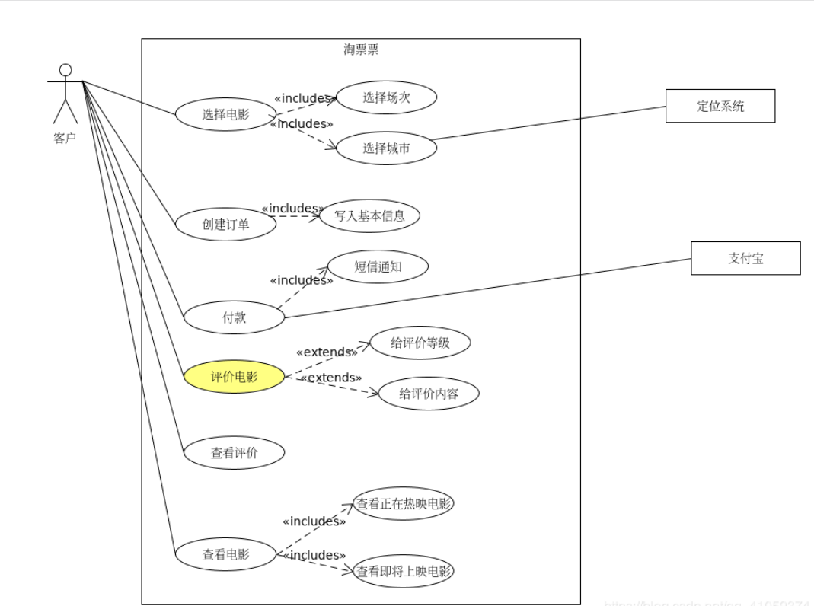
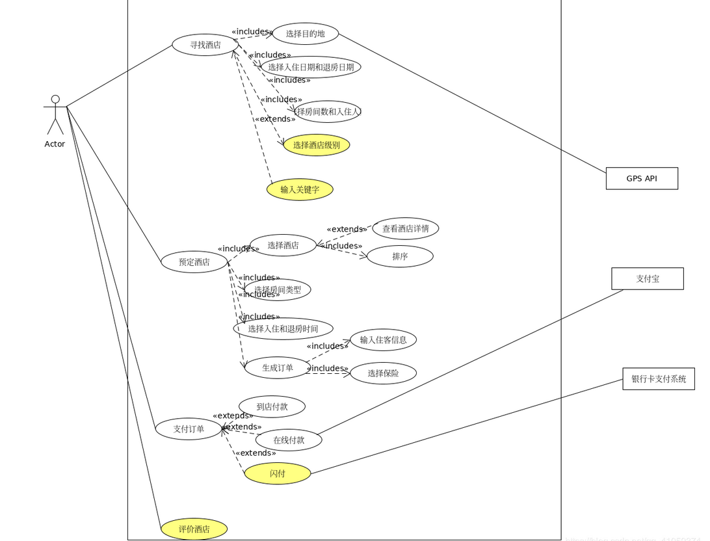

# 系统分析与设计第六周作业

## 1.简答题

 - 用例的概念

    - 用例是软件工程或系统工程中对系统如何反应外界请求的描述，是一种通过用户的使用场景来获取需求的技术。每个用例提供了一个或多个场景，该场景说明了系统是如何和最终用户或其它系统互动，也就是谁可以用系统做什么，从而获得一个明确的业务目标。

 - 用例和场景的关系？什么是主场景或 happy path？
    -   每一个用例提供了一个或多个场景,该场景说明了系统是如何和最终用户或其他系统互动,也就是谁可以用系统做什么,从而获得一个明确的业务目标
    -   主场景对应于系统主要的交互，通常是指成功的场景，所有有关人员的需求都得到了满足。

 - 用例有哪些形式？
    -  Brief: one paragraph summary, usually of the the main success scenario

    -  Casual: informal paragraph format. multiple paragraph that cover various scenarios

    -  Fully: dressed all steps and variations are written in detail, and there are supporting sections, such as preconditions and success guarantees

 - 对于复杂业务，为什么编制完整用例非常难？
        

    - 复杂业务的场景和功能点比较多，子业务之间的逻辑关系比较复杂，如果完整实现，用例图会显得复杂难懂，不易阅读。

 - 什么是用例图？

    - 用例图是指由参与者（Actor）、用例（Use Case），边界以及它们之间的关系构成的用于描述系统功能的视图。用例图（User Case）是外部用户（被称为参与者）所能观察到的系统功能的模型图。用例图是系统的蓝图。用例图呈现了一些参与者，一些用例，以及它们之间的关系，主要用于对系统、子系统或类的功能行为进行建模。

 - 用例图的基本符号与元素？

    ​	用例用椭圆表示,矩形框表示整个系统,矩形框外的小人表示系统的参与者,参与者与用例连线表示参与者与用例有交互.
    ​	虚线表示include 和 extend

 - 用例图的画法与步骤
    - 确定系统边界,用方框表示
    - 确定参与者,用小人表示
    - 确定主要参与者的目标,选择满足参与者目标的用例名称,画成椭圆形,椭圆形在方框之内,表示系统的内部功能
    - 参与者与用例的联系用实线连接
    - 对于系统内部多个用例可能共享一个子用例,或可选功能用例,应该将这些用例拆分,用带箭头的虚线连接,表示include 或 extend.

     

 - 用例图给利益相关人与开发者的价值有哪些？
    - 帮助获取需求
    - 指导测试
    - 在整个过程中的其它工作流起到指导作用

## 2、建模练习题

 - 选择2-3个你熟悉的类似业务的在线服务系统（或移动 APP），如定旅馆（携程、去哪儿等）、定电影票、背单词APP等，分别绘制它们用例图。并满足以下要求：
  请使用用户的视角，描述用户目标或系统提供的服务
  粒度达到子用例级别，并用 include 和 exclude 关联它们
  请用色彩标注出你认为创新（区别于竞争对手的）用例或子用例
  尽可能识别外部系统和服务
  
  - 淘票票

  
  
  - 携程定酒店
  
  

 - 然后，回答下列问题：

    - 为什么相似系统的用例图是相似的？

        - 相似的系统，用户的需求也相似，所以为了提供对应的服务，用例图也是相似的。

    - 如何利用用例图定位创新思路（业务创新、或技术创新、或商业模式创新）在系统中的作用

        - 观察对应创新用例所依赖的外部系统以及与参与者或其他用例的依赖关系，可以很清楚地定位这项用例对应的场景和服务

    - 请使用 SCRUM 方法，选择一个用例图，编制某定旅馆开发的需求（backlog）开发计划表

        | ID   | Title    | Est  | Imp  | How to demo                              | Notes         |
        | ---- | -------- | ---- | ---- | ---------------------------------------- | ------------- |
        | 1    | 查询旅馆 | 6    | 4    | 根据目标城市、时间以及心理价位进行筛选   | GPS定位       |
        | 2    | 预订房间 | 8    | 3    | 用户提供房间类型、入住时长以及人数等信息 | 合理排序      |
        | 3    | 支付订单 | 2    | 1    | 提供第三方支付方式进行支付               | 第三方支付API |
        | 4    | 用户评价 | 6    | 2    | 上传自己的评分，并且能看到其他用户的评分 | -             |

    

    - 根据任务4，参考 使用用例点估算软件成本，给出项目用例点的估算

        | 用例     | 事务 | 计算 | 原因 | UC权重 |
        | -------- | ---- | ---- | ---- | ------ |
        | 查询旅馆 | 4    | 3    |      | 平均   |
        | 预订房间 | 8    | 6    |      | 困难   |
        | 支付订单 | 3    | 1    |      | 简单   |
        | 用户评价 | 5    | 4    |      | 平均   |
